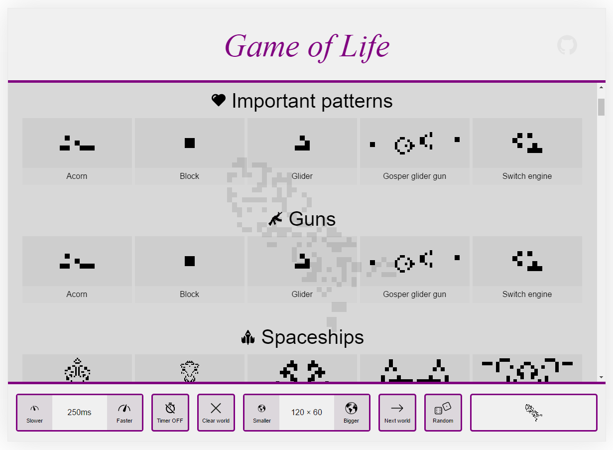
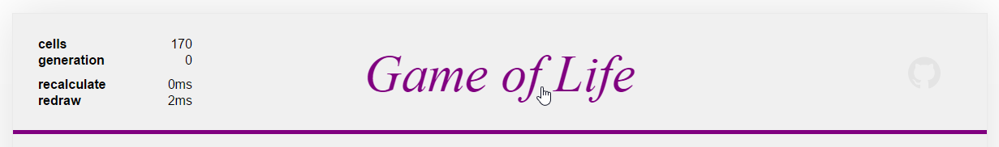

# Game of Life

Game of life written [ES2015](https://babeljs.io/docs/learn-es2015/) and [Redux](http://redux.js.org/)

## Demo

http://hurtak.github.io/game-of-life/

## Features

Nice interface

Plenty of patterns to play with

Stats (hidden feature, activate it by clicking on the 'Game of Life' heading)

## Technology overview

- No frameworks used, programmed in vanilla [ES2015](https://babeljs.io/docs/learn-es2015/) (compiled to ES5 with [Babel](https://babeljs.io/))
- [Redux](http://redux.js.org/) for state management
- [BEM](https://css-tricks.com/bem-101/) for styles management with [LESS](http://lesscss.org/) as CSS preprocessor
- Tested with [AVA](https://github.com/sindresorhus/ava)
- [Jsdom](https://github.com/tmpvar/jsdom) for automatic downloading of patterns from [conwaylife.com/wiki](http://www.conwaylife.com/wiki)

## Development & Compilation

#### Prerequisites

- [Node.js](http://nodejs.org) is required
- install dependencies with `npm install`

#### Development mode

- `npm run dev` compile app in development mode and start web server with live reload

#### Production mode

- `npm run dist` compile app in production mode and start web server

#### Benchmark

- tests how long it takes to recalculate world state
- located in `./app/scripts/benchmark/` directory
- easiest way to run it is to uncomment benchmark import in `./app/scripts/app.js`, start the app and look into browser console
- you can tune settings (number of iterations, tested world size) in `./app/scripts/benchmark/benchmark.js`

#### Scripts for downloading game of life patterns

- located in `./scripts/download-patterns-from-wiki.js`
- run with node `node ./scripts/download-patterns-from-wiki.js`
- downloads patterns into `./scripts/data/` directory

## TODO / Potential improvements

- Add help screen to explain what is going on
- improve performance
- add tooltip to cursor patterns
- selected cursor highlight in cursors menu
- close button inside cursors menu?
- save state to localstorage?
- save world to url?
- draw already visited cells with different color (fade out this color after some time)
- use setTimeout based timer instead of setInterval?
- use requestAnimationFrame?
- world recalculation in service worker?
